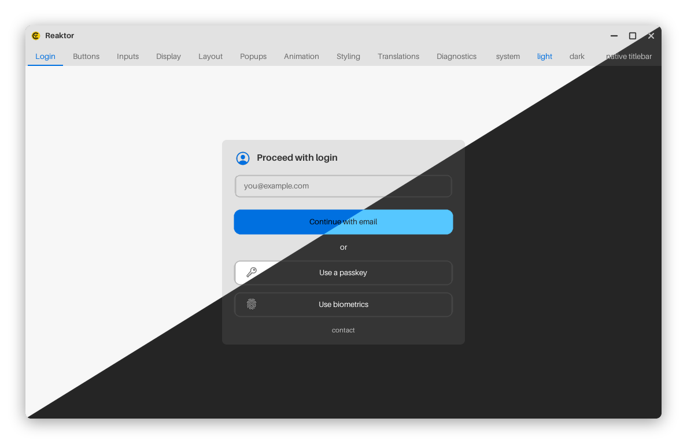
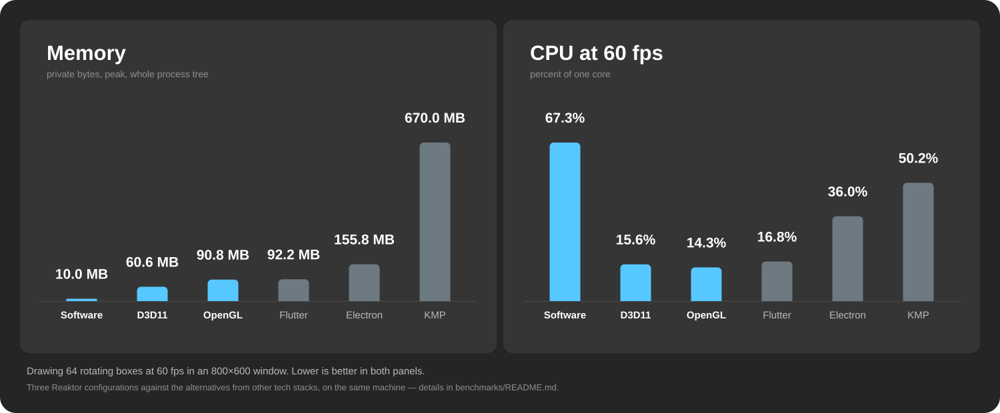

# Reaktor

A Nuklear-powered (GUI) engine for C.

<p align="center">
  
</p>

**[Try the showcase in your browser](https://alpaq92.github.io/Reaktor/)** — the
same program, built to WebAssembly.

Tired of C having no cross-platform GUI — nothing like
[Avalonia](https://github.com/avaloniaui/avalonia),
[Shaft](https://github.com/ShaftUI/Shaft) or
[Freya](https://github.com/marc2332/freya) — and of leaning on toolkits that
want hundreds of megabytes just to put a dialog on screen? No? I was. So I
wrote Reaktor: a GUI library that is complete without being big. A 2.3 MB
binary, about 10 MB of RAM, and no GPU required.

> ⚠️ **Reaktor is in active development**, and breaking changes might occur.

<p align="center">
  <a href="docs/PERFORMANCE.md"></a>
</p>

How these were measured, and on what, is in
[PERFORMANCE.md](docs/PERFORMANCE.md).

## What it is made of

- **[Nuklear](https://github.com/Immediate-Mode-UI/Nuklear)** draws the
  widgets. **[SDL3](https://github.com/libsdl-org/SDL)** supplies the window,
  the input and the software renderer. **libcss**, taken from
  **[LCUI](https://github.com/lc-soft/LCUI)**, parses the stylesheet, which is
  read at startup rather than compiled in.
- **[Onlay](https://github.com/Alpaq92/Onlay)** computes the rectangles — a
  fork of [randrew/layout](https://github.com/randrew/layout) with weighted
  tracks, gaps and padding.
- Every dependency is a submodule, read at runtime as it ships. No values are
  copied out of one and into this tree.
- For the complete list, check [docs/NOTICE.md](docs/NOTICE.md).

## Features

- **Widgets** — 15 declarative specs, with all of Nuklear underneath.
- **Styling from CSS** — color, type, borders, radii, spacing, `:hover` /
  `:active`, read at runtime. Swap the sheet, the app changes.
- **Animation** — 31 easing curves, keyed per widget.
- **Accessibility** — automatic: UI Automation, NSAccessibility, AT-SPI and a
  DOM subtree on the web, with keyboard focus and shortcuts.
- **HiDPI** — layout in logical pixels, atlas baked at the display's size.
- **Light and dark** — follows the system, or pick one.
- **Localization** — a catalog per language; plural rules, numbers, money and
  dates as each language writes them.
- **Text past Latin-1** — direction, shaping, fallback fonts at any size and
  Unicode line breaking, so Japanese wraps properly.
- **Modular** — accessibility, localization and text shaping are modules, on
  by default; `-DREAKTOR_TEXT=OFF` and friends swap in a stub, and only what
  that module drew stops being drawn.
- **Five platforms** — Windows, macOS, Linux, the BSDs and WebAssembly, one
  set of sources on the same software rasterizer, no GPU.
- **Nothing drawn at rest** — 0% of a core while it sits there.

## Build

Needs CMake, the submodules and a C11 compiler: Reaktor is C99, but mojibake,
which the Text module uses, is C11.

```bash
git clone --recursive https://github.com/Alpaq92/Reaktor
cd Reaktor
./build.sh          # build.ps1 on Windows
./build/showcase
```

For the browser, `./build-wasm.sh` (`build-wasm.ps1` on Windows, needs
[emsdk](https://emscripten.org)) builds all three to WebAssembly, then serve
`build-wasm/` over HTTP.

## Usage

```c
static char name[64];
static int  len;

REAKTOR_COLUMN(.gap = 10) {
    reaktor_label(&(reaktor_label_spec){ .text = "What is your name?" });

    reaktor_field(&(reaktor_field_spec){
        .buf = name, .len = &len, .cap = sizeof name, .hint = "Ada" });

    if (reaktor_button(&(reaktor_button_spec){ .label = "Say hello" }))
        printf("Hello, %s!\n", name);
}
```

There are no colors in that code, no corner radii, no padding, no font sizes.
They come from a stylesheet that is read when the program starts, so changing
the sheet changes the application. Screen readers are covered too, with
nothing written for them here — each widget reports its own name, value and
position.

## Documentation

- [docs/DOCUMENTATION.md](docs/DOCUMENTATION.md) — the whole of it: the
  declarative API, layout, styling, accessibility and animation, then the tree,
  the tests, the command-line flags, localization and text.
- [docs/DEMO.md](docs/DEMO.md) — the four applications in this repository and
  what each one is for.
- [docs/PERFORMANCE.md](docs/PERFORMANCE.md) — what it costs, measured on four
  platforms, and against Flutter, Electron and Compose Multiplatform on one.
- [benchmarks/BENCHMARKS.md](benchmarks/BENCHMARKS.md) — those three as
  projects of their own, drawing the same picture, and the script that
  measures them all the same way.
- [docs/NOTICE.md](docs/NOTICE.md) — what it depends on, and under what
  license.

## License

MIT. The dependencies keep their own — see [docs/NOTICE.md](docs/NOTICE.md).
