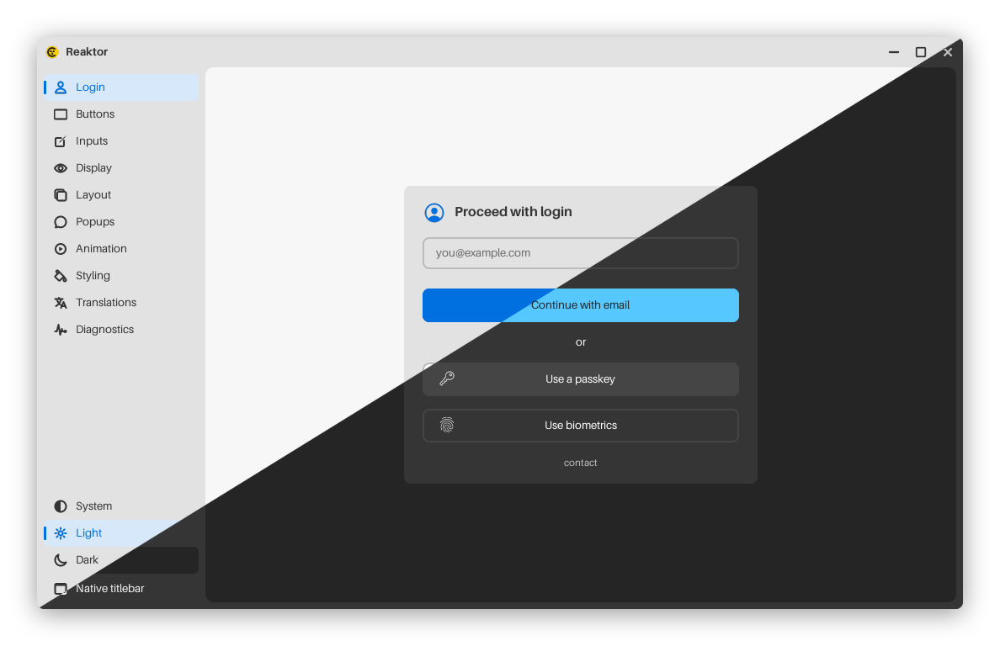
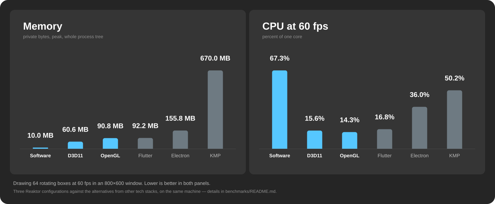

# Reaktor

A Nuklear-powered GUI library for C.

<p align="center">
  
</p>

**[Try the showcase in your browser](https://alpaq92.github.io/Reaktor/)** — the
same program, built to WebAssembly.

Tired of C having no cross-platform GUI — nothing like
[Avalonia](https://github.com/avaloniaui/avalonia),
[Shaft](https://github.com/ShaftUI/Shaft) or
[Freya](https://github.com/marc2332/freya) — and of toolkits that want hundreds
of megabytes to put a dialog on screen? I was. So I wrote Reaktor: complete
without being big. A 2.3 MB binary, about 10 MB of RAM, and no GPU required.

> ⚠️ **Reaktor is in active development**, and breaking changes might occur.

<p align="center">
  <a href="docs/PERFORMANCE.md"></a>
</p>

How, and on what, is in [PERFORMANCE.md](docs/PERFORMANCE.md).

## Features

- **17 declared widgets** — buttons, fields, checks, radios, sliders, knobs,
  combos, a color picker, a sidebar and tabs among them — with all of Nuklear
  underneath.
- **Layers** — dialogs inside the window, toasts, more windows, and an icon
  in the system tray with a menu.
- **Styled by CSS** read at run time: color, type, borders, radii, spacing,
  `:hover` and `:active`, light and dark. Swap the sheet and the app changes.
- **Accessible with no code** — UI Automation, NSAccessibility, AT-SPI and a
  DOM subtree on the web, with keyboard navigation throughout.
- **Localization** — catalogs, plural rules, and numbers, money and dates as
  each language writes them.
- **Text past Latin-1** — direction, shaping, fallback fonts and Unicode line
  breaking, so Japanese wraps properly.
- **Animation** — 31 easing curves, keyed per widget.
- **Modular** — accessibility, localization and text shaping each swap for a
  stub, and only what they drew stops being drawn.
- **Windows, macOS, Linux, the BSDs and WebAssembly** from one set of sources,
  on one software rasterizer, at any display scale.
- **Nothing drawn at rest** — 0% of a core while it sits there.

## Build

CMake, the submodules and a C11 compiler: Reaktor is C99, but mojibake, which
the Text module uses, is C11.

```bash
git clone --recursive https://github.com/Alpaq92/Reaktor
cd Reaktor
./build.sh          # build.ps1 on Windows
./build/showcase
```

`./build-wasm.sh` (`build-wasm.ps1` on Windows, with
[emsdk](https://emscripten.org)) builds the web versions into `build-wasm/`, to
be served over HTTP.

## Usage

```c
static char name[64];
static int  len;

REAKTOR_COLUMN(.gap = 10) {
    reaktor_label(&(reaktor_label_spec){ .text = "What is your name?" });

    reaktor_field(&(reaktor_field_spec){
        .buf = name, .len = &len, .cap = sizeof name, .hint = "Ada" });

    if (reaktor_button(&(reaktor_button_spec){ .label = "Say hello" }))
        printf("Hello, %s!\n", name);
}
```

No colors, radii, padding or font sizes: they come from a stylesheet read at
startup. Nothing for screen readers either: each widget reports its own name,
value and position.

## Made of

[Nuklear](https://github.com/Immediate-Mode-UI/Nuklear) draws the widgets.
[SDL3](https://github.com/libsdl-org/SDL) supplies the window, input, tray and
software renderer. libcss, from [LCUI](https://github.com/lc-soft/LCUI), parses
the stylesheets, and [Onlay](https://github.com/Alpaq92/Onlay), a fork of
[randrew/layout](https://github.com/randrew/layout), computes the rectangles.
Every dependency is a submodule, used as it ships; the full list is in
[NOTICE.md](docs/NOTICE.md).

## Documentation

- [DOCUMENTATION.md](docs/DOCUMENTATION.md) — the whole of it: every widget,
  layout and layer, styling, then how it works inside.
- [DEMO.md](docs/DEMO.md) — the four programs in this repository.
- [PERFORMANCE.md](docs/PERFORMANCE.md) — what it costs, measured.
- [BENCHMARKS.md](benchmarks/BENCHMARKS.md) — the comparison, as runnable
  projects.
- [NOTICE.md](docs/NOTICE.md) — dependencies and licenses.

## License

MIT. The dependencies keep their own — see [NOTICE.md](docs/NOTICE.md).
