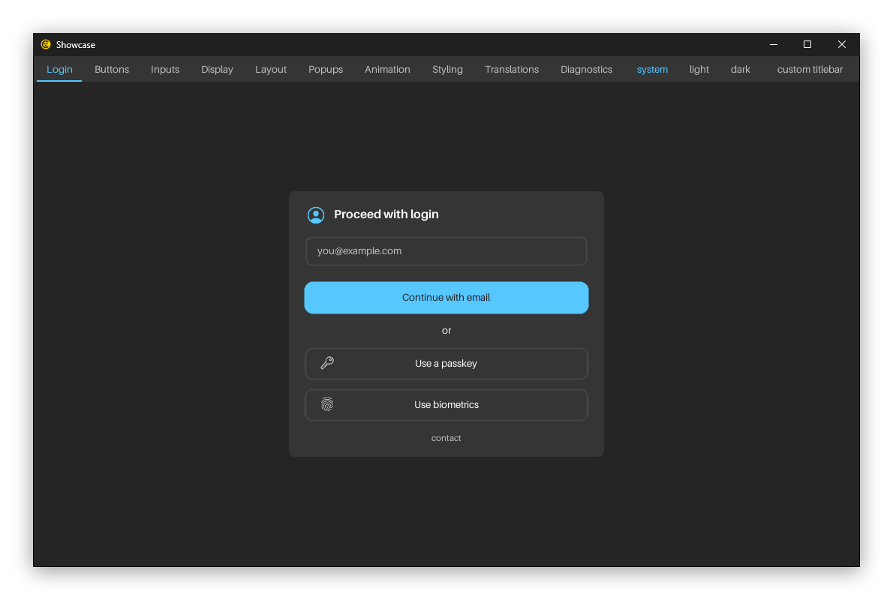
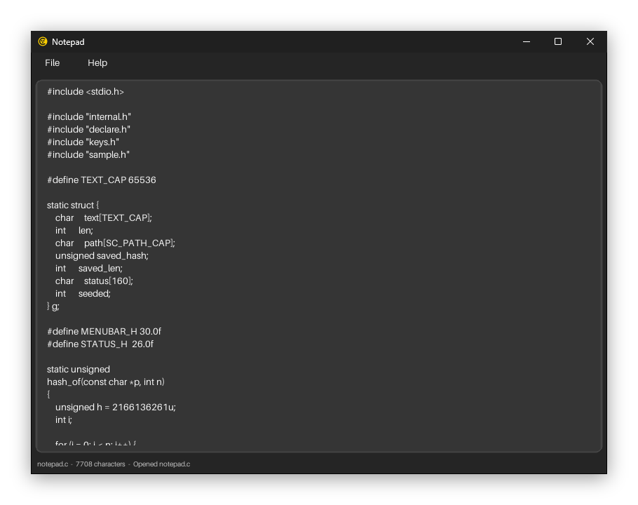
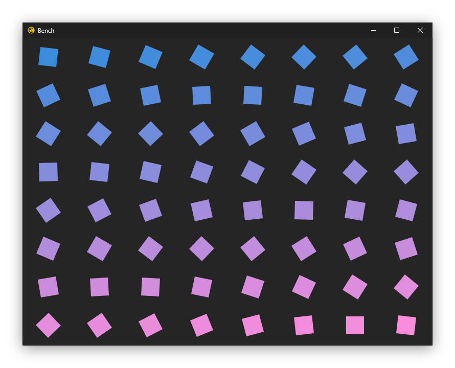
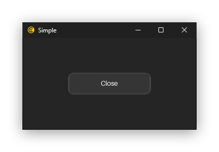

# The four applications

This repository builds four programs. They share `runtime/` and `core/` byte
for byte; what differs is `samples/`, and which optional modules each links.
The showcase takes all three — the accessibility bridges, Locale and Text. The
other three take none, so they show what the runtime costs by itself, and a
screen reader finds nothing in them.

| | Size | What it is for |
| --- | --- | --- |
| `showcase` | ~3,000 lines | Every widget, both schemes, three languages, and how far the CSS seam reaches |
| `notepad` | ~290 lines | A text editor that opens, edits and saves a file |
| `bench` | ~220 lines | The workload the published figures are measured on, here and in the other four frameworks |
| `simple` | ~60 lines | One button that closes the window |

```bash
./build/showcase
./build/notepad somefile.txt
./build/bench --bench-seconds 6 --no-vsync
./build/simple
```

## What an application is

Whatever implements the six functions in
[`samples/sample.h`](../samples/sample.h). The runtime owns the window, the
event loop, the stylesheets, the font atlas and the accessibility tree; the
application owns what is drawn and what the keys mean.

`simple` writes one of the six and returns a constant from the other five,
which is the honest measure of how much of an application the runtime is
already doing.

## Showcase

<p align="center">
  
</p>

Ten pages — Login, Buttons, Inputs, Display, Layout, Popups, Animation,
Styling, Translations, Diagnostics. It is the reference for what the library
can draw, and it is also where the project's claims are tested rather than
asserted:

- **Styling** reads simple.css over the top of tiny.css at the flick of a
  checkbox, and prints what each rule resolved to beside the widgets it
  painted — so the page cannot say one thing while the screen shows another.
- **Translations** sets the opening of *The Ugly Duckling* in English, Polish
  and Japanese, three public-domain translations read from the catalogs, and
  beside it the day the story was first published, a number, one amount in
  three currencies and a count of ducklings, each formatted the way that
  language writes it. The Japanese is the Text module's, drawn from M PLUS 1p
  at the size each heading and paragraph is set in.
- **Diagnostics** reports the renderer, where each frame's milliseconds went
  and where each megabyte went, live.
- **Animation** draws all 31 easing curves from the same function the widgets
  animate through.

It draws its own titlebar, which is why it carries a tab strip and window
controls that the others do not.

## Notepad

<p align="center">
  
</p>

A real text editor in one file: a menu bar, a multiline field, a status line,
open and save through the platform's own file dialog, and five keyboard
shortcuts. It exists because a showcase can hide a lot — a page of widgets
never has to answer what happens when a document is modified, or where the
menu's last item lands when the popup is a pixel too short.

## Bench

<p align="center">
  
</p>

Sixty-four boxes rotating, as fast as the display will take them or flat out
with `--no-vsync`, for however many seconds `--bench-seconds` asks for, and then
what the run cost on stdout. Six seconds flat out, on the Windows VM that
[PERFORMANCE.md](PERFORMANCE.md#where-the-numbers-came-from) names:

```
size          800x600
frames        4290
fps           715.0
ms_build      0.03
ms_render     0.07
ms_present    1.27
ms_per_frame  1.37
cpu_at_60fps  8.2
cpu_percent   97.4
private_mb    7.1
```

`--boxes <n>` changes the workload and `--fps <n>` holds it to a rate, sleeping
out the rest of each frame instead of drawing flat out. `size` is the drawing
area, which is there because the same picture is drawn by four other frameworks
in `benchmarks/` and a window that came out the wrong size would otherwise say
nothing about it.

Pass `--no-vsync` for those, and read `cpu_at_60fps` rather than `cpu_percent`.
Left on vsync, `SDL_RenderPresent` spends the rest of the frame waiting for the
next vblank, and the process is charged for that wait or not depending on
whether SDL blocks or spins — which is how the same 386 frames come out
anywhere between 0.3% and 99.6% of a core. Free-running, every millisecond is
drawing and the number holds to a tenth.

It is deliberately the thing this library is worst at. Every other figure in
[PERFORMANCE.md](PERFORMANCE.md) is a count of frames, because nothing is drawn
while nothing changes — an animation that never stops throws that advantage
away and measures the drawing instead of the design. Reaktor's three bars in
the chart there come from this program, one per renderer; the other three come
from `benchmarks/`, which is the same picture written in Flutter, Electron and
Compose Multiplatform, so that the comparison is one workload and one sampler
rather than six readings from six machines.

## Simple

<p align="center">
  
</p>

One centered button that closes the window, in sixty lines including the
five functions it does not use. It is the smallest thing that is still an
application, and it is what to copy when starting one.

## Running one the same way twice

Both of the verification hooks are command-line flags — Reaktor reads no
environment variables:

```bash
./build/showcase --tab 7 --theme dark --shot styling.bmp --a11y-dump styling.txt
```

`--shot` writes the window once the frame settles and quits; `--a11y-dump`
writes the accessibility tree, one line per node with its role, name, value,
state and rectangle. Diff two of those and a change that moved something by a
pixel says so. See [DOCUMENTATION.md](DOCUMENTATION.md#command-line-flags).
