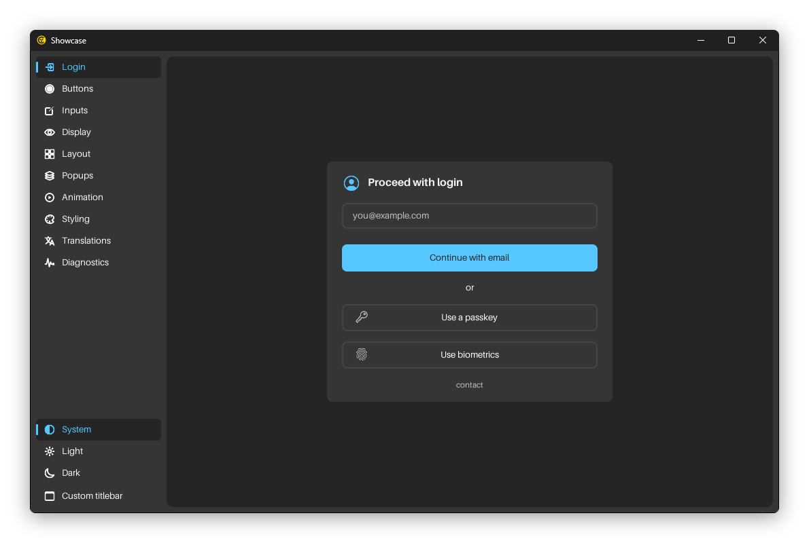
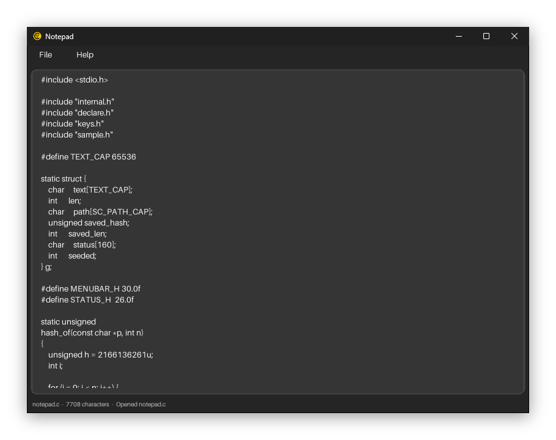
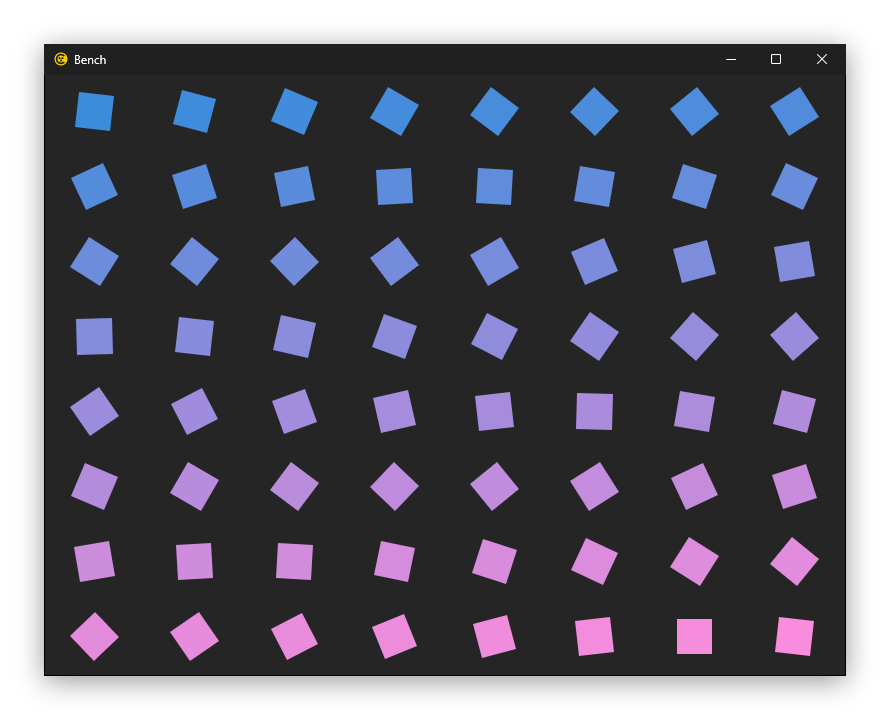
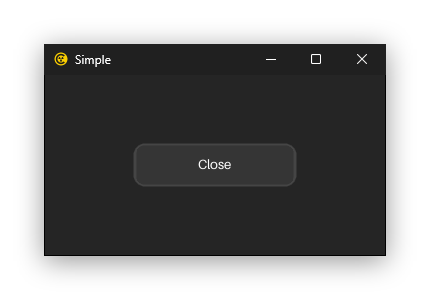

# The four programs

All four share `runtime/` and `core/`; what differs is `samples/`, and which
modules each links. The showcase takes all three — the accessibility bridges,
Locale and Text. The others take none, so they show what the runtime costs by
itself, and a screen reader finds nothing in them.

| | Lines | For |
| --- | --- | --- |
| `showcase` | ~3,300 | Every widget and layer, both schemes, three languages, and how far the CSS reaches |
| `notepad` | ~280 | A text editor that opens, edits and saves a file |
| `bench` | ~150 | The workload the published figures measure, here and in four other frameworks |
| `simple` | ~40 | One button that closes the window |

```bash
./build/showcase
./build/notepad somefile.txt
./build/bench --bench-seconds 6 --no-vsync
./build/simple
```

## Showcase

<p align="center">
  
</p>

Ten pages in a sidebar — Login, Buttons, Inputs, Display, Layout, Popups,
Animation, Styling, Translations, Diagnostics — with the color scheme and the
titlebar switch at its foot, and an icon in the tray. It is the reference for
what the library draws, and where its claims are tested rather than asserted:

- **Styling** lays simple.css over tiny.css at the flick of a checkbox, and
  prints what each rule resolved to beside the widgets it painted.
- **Translations** sets the opening of *The Ugly Duckling* in English, Polish
  and Japanese from the catalogs, beside a date, a number, one amount in three
  currencies and a count of ducklings, each written the way that language
  writes it. The Japanese is drawn by the Text module.
- **Popups** opens floaters, toasts, windows of their own, menus and the tray.
- **Diagnostics** shows the renderer, and where each frame's milliseconds and
  each megabyte went, live.
- **Animation** draws all 31 easing curves through the function the widgets
  animate with.

## Notepad

<p align="center">
  
</p>

A real editor in one file: a menu bar, a multiline field, a status line, the
platform's own open and save dialogs, and five shortcuts. A page of widgets
never has to answer what happens to a modified document, or where a menu's last
item lands when its popup is a pixel short; this does.

## Bench

<p align="center">
  
</p>

Sixty-four rotating boxes, at the display's rate or flat out with
`--no-vsync`, for `--bench-seconds`, then what the run cost on stdout. Six
seconds flat out, on the Windows VM that
[PERFORMANCE.md](PERFORMANCE.md#where-the-numbers-came-from) names:

```
size          800x600
frames        4290
fps           715.0
ms_build      0.03
ms_render     0.07
ms_present    1.27
ms_per_frame  1.37
cpu_at_60fps  8.2
cpu_percent   97.4
private_mb    7.1
```

With `--no-vsync`, read `cpu_at_60fps`, not `cpu_percent`. On vsync,
`SDL_RenderPresent` waits for the next vblank, and whether that wait is charged
depends on whether SDL blocks or spins: the same 386 frames have read anywhere
from 0.3% to 99.6% of a core. `size` is the drawing area, printed because four
other frameworks in `benchmarks/` draw the same picture. `--boxes` changes the
workload, and `--fps` holds it to a rate.

It is deliberately what the library is worst at. Everything else in
PERFORMANCE.md counts frames, because nothing is drawn while nothing changes;
an animation that never stops measures the drawing instead. Reaktor's three
bars in the chart there come from this program, one per renderer.

## Simple

<p align="center">
  
</p>

One centered button that closes the window, in about forty lines: the
smallest thing that is still an application, and the one to start from.

## Running one the same way twice

```bash
./build/showcase --tab 7 --theme dark --shot styling.bmp --a11y-dump styling.txt
```

`--shot` writes the window once it settles and quits; `--a11y-dump` writes
every node's role, name, value, state and rectangle. Diff two dumps and
anything that moved by a pixel says so. The rest of the flags are in
[DOCUMENTATION.md](DOCUMENTATION.md#command-line-flags).
