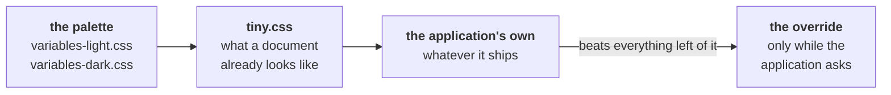
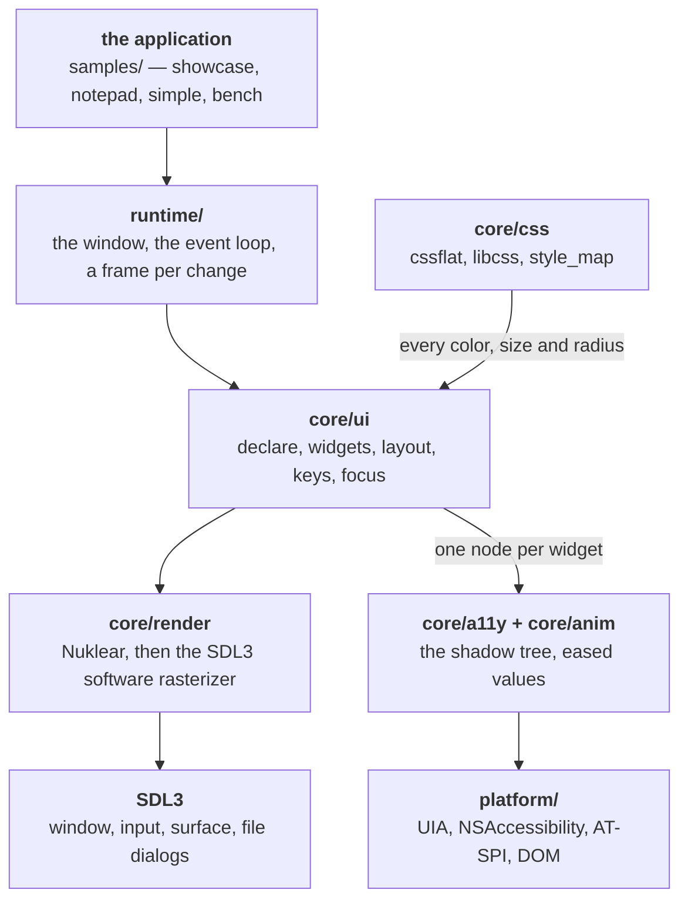
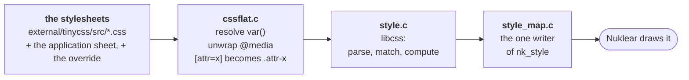

# Reaktor

Using it, and working on it.

**Using it** — [An application](#an-application) ·
[Declaring widgets](#declaring-widgets) · [Layout](#layout) ·
[Styling](#styling) · [Accessibility](#accessibility) ·
[Animation](#animation) · [Reaching past the library](#reaching-past-the-library)

**Inside** — [The architecture](#the-architecture) · [The tree](#the-tree) ·
[The style pipeline](#the-style-pipeline) ·
[The frame loop](#the-frame-loop) · [Tests](#tests) ·
[Command-line flags](#command-line-flags) · [The renderer](#the-renderer) ·
[The web build](#the-web-build) · [Localization](#localization) ·
[Nuklear behaviors](#nuklear-behaviors-that-have-already-cost-an-afternoon)

---

## An application

Six functions, in [`samples/sample.h`](../samples/sample.h). The runtime owns
the window, the event loop, the stylesheets, the font atlas and the
accessibility tree; you own what is drawn and what the keys mean.

```c
void page_shell(App *app, struct nk_context *ctx, int win_w, int win_h);
int  sample_key(App *app, const SDL_Event *e);
void sample_window(reaktor_window_spec *out);
void sample_file_taken(App *app);
void sample_args(App *app, int argc, char **argv);
SDL_HitTestResult SDLCALL window_hit_test(SDL_Window *, const SDL_Point *, void *);
```

Only `page_shell` usually has anything in it. `samples/simple/simple.c` is a
working application in sixty lines and returns a constant from the other five.

`page_shell` is called once a frame inside a panel that already covers the
window, so you start by laying out rather than by opening anything.

## Declaring widgets

A widget is a designated-initialiser struct. Every field is optional.

```c
if (reaktor_button(&(reaktor_button_spec){
        .label = "Save",
        .keys  = "Control+S",           /* announced, not bound */
        .box   = { .w = 120.0f } }))
    save();
```

Answers non-zero on the frame it was pressed. There is no widget object, no
handle and no id to keep: the widget *is* the code that made it, reading your
variable and answering in your scope.

The fifteen specs are in [`core/ui/declare.h`](../core/ui/declare.h): button,
label, icon, field, link, swatch, check, radio, select, slider, progress,
knob, property, combo, color.

Two open a scope rather than answering:

```c
REAKTOR_COMBO(.label = sizes[pick], .name = "Size", .body_h = 130) {
    for (i = 0; i < 3; i++)
        if (reaktor_combo_item(sizes[i], i == pick)) pick = i;
}
```

A combo's body is Nuklear's own panel, so lay it out with
`nk_layout_row_dynamic` — a declared tree belongs to one panel and the popup
is another. Do not `return` or `break` out of a scope.

## Layout

Containers are scopes; children are declared inside them.

```c
REAKTOR_COLUMN(.gap = 10.0f) {
    REAKTOR_ROW(.h = 30.0f, .gap = 6.0f, .flags = REAKTOR_LAY_FILL_X) {
        reaktor_button(&(reaktor_button_spec){
            .label = "Left",  .box = { .w = 90.0f } });
        reaktor_button(&(reaktor_button_spec){
            .label = "Rest",  .box = { .flags = REAKTOR_LAY_FILL_X } });
    }
}
```

`REAKTOR_ROW`, `REAKTOR_COLUMN` and `REAKTOR_FREE` — the last places children
by their own margins and lets them overlap.

On a box:

| | |
| --- | --- |
| `.w`, `.h` | its size — **a floor** when the box also fills that axis |
| `.weight` | its share of what is left over, relative to its siblings; 0 reads as 1 |
| `.gap` | between *its children*, not outside them |
| `.ml .mt .mr .mb` | margins: space outside it |
| `.flags` | `FILL_X` `FILL_Y` `WRAP` `CENTER_X` `CENTER_Y` `PACK_CENTER` `PACK_END` `PACK_SPREAD` |

A width that is also a floor is one rule covering what CSS spells as three: a
fixed track is `.w` alone, a minimum that grows is `.w` with `FILL_X`, and a
fraction is `FILL_X` with `.weight`.

**A box is placed one frame late.** A frame declares its boxes as it draws
them, which is too early to know where any of them go — the last sibling is
declared long after the first is drawn. So a frame draws into the rectangles
computed at the end of the previous one, found by the accessibility id. A box
seen for the first time is skipped for one frame rather than guessed at.

Two things follow. Content-dependent sizes (a wrapped paragraph) need a
further frame to settle. And **a widget is found again by its name**, so one
whose text changes every frame needs a stable `.name` or it is a new box every
frame and never has a rectangle at all. The runtime notices: after sixteen
unsettled frames it stops asking for redraws and prints which box is missing.

## Styling

Sheets are read in order and the last one wins, because that is what CSS
already does with a tie. Nothing merges them.



A widget asks for a selector and gets computed values, or `matched` clear and
Nuklear's default:

```c
reaktor_style s;
reaktor_style_get("button", &s);
if (s.matched) { /* s.bg, s.fg, s.border, s.rounding, s.pad_x, s.font_px */ }
```

The override slot is read only while the application asks for it. The
showcase's **Styling** page reads simple.css over the top of tiny.css at the
flick of a checkbox, which is the only honest test of the claim that the look
is not in the code.

Two limits worth knowing:

- **Attribute selectors are rewritten, not matched.** LCUI implements type,
  class, id and descendant selectors, so `cssflat` turns `input[type=range]`
  into `input.type-range` and the widget asks for that spelling. An operator
  form — `[href^="http"]` — still cannot be expressed and is dropped.
- **Controls a document does not have** — a slider, a progress bar, a knob —
  have no rule to inherit, so they borrow the rule of what they resemble: the
  rail from `input`, the accent from `a`, a knob's body from `button`. Reading
  the accent off the `a` rule rather than a `--links` token is what makes that
  work with a sheet that never declares one.

`prefers-color-scheme` is honored: the branch matching the active scheme is
unwrapped before parsing. Width and print queries are dropped — a viewport
query means nothing to a window that is not a document.

## Accessibility

There is nothing to do. A declared widget reports its own role, name, value,
state and bounds, and the tree is diffed each frame and served to the
platform — UI Automation on Windows, NSAccessibility on macOS, AT-SPI on the
free desktops, a DOM subtree beside the canvas in a browser.

For the widgets the library has no spec for, report them yourself:

```c
reaktor_note(app, REAKTOR_A11Y_TREEITEM, label, NULL, state, bounds);
```

## Animation

A number that takes time to change, keyed by the same accessibility id.

```c
REAKTOR_COLUMN(.name = "Track", .h = 56.0f) {
    unsigned id = reaktor_box_id();
    float    x  = reaktor_animate(id, 0, target, 320.0f,
                                  REAKTOR_EASE_CUBIC_OUT);
    /* draw at x */
}
```

The first call starts at its target and stays there — an animation is a
*change*, and nothing has changed yet. Afterward a new target starts a run
from wherever the value is, so a target that changes mid-flight redirects
rather than restarts. `channel` distinguishes several numbers on one widget.

31 curves; `reaktor_ease_at(curve, t)` is public so a page can draw them.
Entries die when the accessibility diff says the node is gone. A page with
nothing moving asks for no frames at all.

## Reaching past the library

Nuklear is still there. Groups, trees, list views, charts, menus and popup
bodies have no spec, and the samples use `nk_*` directly for them. A declared
tree and `nk_layout_row_*` cannot share a panel, so convert a whole container
at a time — but a popup or a group is its own panel and may be laid out
imperatively inside a declared page.

---

## The architecture



Only the top box is yours. A spec goes into `core/ui`, which asks `core/css`
what it should look like and `core/ui/layout` where it goes, files a node in
the shadow tree, and hands Nuklear a draw call — so the right column happens
whether the application asks for it or not.

## The tree

```
core/base      paths, metrics, the shared header
core/css       cssflat pre-processor, libcss front end
core/render    Nuklear impl, the SDL3 backend, drawing, SVG icons
core/ui        the declarative API, layout, widgets, style map, keys, focus
core/a11y      the shadow tree and its diff
core/anim      eased values keyed by a11y id
platform/      system theme, and one accessibility bridge per platform
runtime/       app.c: the window, the event loop, the frame
samples/       showcase, notepad, simple, bench
tools/         the tests, the icon compiler, vmwalk
benchmarks/    bench's workload in four other frameworks, and one sampler
external/      eight submodules, read as they ship
```

`runtime/` and `core/` build into `reaktor_runtime`, a static library the four
executables link. Nothing in `core/` knows which application it is in.

## The style pipeline



**`cssflat` exists because libcss is not a browser.** It has no custom
properties, so every `var()` is resolved before the engine sees the text; no
`@media`, so the branch matching the active scheme is unwrapped and the rest
dropped; and no attribute or pseudo-element selectors, so rules carrying them
are removed rather than left to fail silently.

**`style_map.c` is the only writer of `nk_style`.** Setting a widget style
anywhere else works right up until a theme change reloads the sheets.

**The rule store is rebuilt on every load.** libcss adds rules to a global
store and never takes a sheet's rules back out, so `reaktor_style_init()`
destroys and re-creates it — without that, each scheme switch stacked another
copy of tiny.css.

## The frame loop

There is no loop. SDL is told `SDL_HINT_MAIN_CALLBACK_RATE = "waitevent"`, so
`SDL_AppIterate` runs when an event arrives and returns immediately unless
`app->dirty` is set. What sets it: a widget being clicked, typed into or
dragged; the pointer crossing a **hot rectangle** registered last frame (that
is how hover repaints without polling); the window moving, resizing or changing
scheme; an animation still running.

While a mouse button is held the rate switches to the display's refresh, with a
two-frame settle after release, so the frame that completes a click is not also
the frame that stops scheduling frames.

The app therefore measures 0% of a core at rest, and **adding a timer or an
unconditional repaint to make something update is the wrong fix** — mark the
thing that changed instead. [PERFORMANCE.md](PERFORMANCE.md) is what that costs
on four platforms.

## Tests

Five, built by default, run from `build/`:

| | |
| --- | --- |
| `laytest` | the layout engine's own placement |
| `onlaytest` | Onlay upstream's suite, unmodified |
| `a11ytest` | node identity, the diff, the pool |
| `animtest` | curves, retarget, eviction |
| `keytest` | chord parsing and formatting |

Beyond that, verification is the **accessibility dump**: run with
`--a11y-dump <path>` and every node's role, name, value, state and
rectangle is written out once the frame settles. Diff two of those and a change
that moved something by a pixel says so. It has caught more regressions here
than looking has.

And when a fix is visual, **look at the framebuffer**. `--shot <path.bmp>`
writes the window once it settles, then quits. Reasoning from a library's source
about where it puts a glyph produces confident, wrong answers.

## Command-line flags

**Reaktor reads no environment variables.** Every default is compiled in, and
the only things worth overriding are the ones that make a run reproducible —
so that two screenshots can be compared, or two accessibility dumps diffed.

The runtime takes these and removes them from `argv` before the application
sees it, so an application's own arguments are unaffected:

| Flag | Effect |
| --- | --- |
| `--shot <path.bmp>` | Write the window once it settles, then quit |
| `--a11y-dump <path>` | Write the accessibility tree once it settles |
| `--theme <system\|light\|dark>` | Which color scheme to open in |
| `--renderer <name>` | `software` (the default), `auto` to let SDL pick, or a driver name |

The showcase adds two of its own, through `sample_args`:

| Flag | Effect |
| --- | --- |
| `--tab <0-8>` | Login, Buttons, Inputs, Display, Layout, Popups, Animation, Styling, Diagnostics |
| `--scroll <px>` | How far that page starts scrolled |

And `bench` adds four:

| Flag | Effect |
| --- | --- |
| `--bench-seconds <n>` | How long to draw before printing and quitting |
| `--no-vsync` | Free-run, so the figures measure drawing and not waiting |
| `--fps <n>` | Hold the run to a rate, sleeping out the rest of each frame |
| `--boxes <n>` | How many boxes to rotate (64 by default) |

The last two exist because the same workload is drawn by four other frameworks
in `benchmarks/`, which take the same flags and print the same keys. Pair them
with `--renderer` and the same executable supplies three of the bars in
PERFORMANCE.md's chart.

```bash
./build/showcase --tab 7 --theme dark --shot styling.bmp --a11y-dump styling.txt
```

`--renderer` exists to measure that choice rather than assert it, and it is the
one flag that can change what the window looks like: the feathering rules in
`nk_sdl3_renderer.h` are written against the software rasterizer. On a machine
with no GPU it is a good way to confirm the choice — `--renderer direct3d11`
lands on WARP and costs four times the frame.

Everything else is a decision the library makes rather than one it asks about:
vsync and anti-aliasing are on, frames are drawn on events, and the assets are
found by walking up to the `.reaktor-root` marker. The showcase's Diagnostics page
reports what each of those settled on, plus where each frame's milliseconds
and each megabyte went. Prefer it to a guess: several plausible optimizations
here turned out to be measurably worse.

## The renderer

`auto` is **the software rasterizer, on every platform**. The app draws nothing
at rest, so a GPU buys it nothing it can measure; a GPU path costs
unconditionally, and on a machine without one it costs a great deal — SDL's
software renderer measured 13.1 ms of CPU per frame against Direct3D-on-WARP's
78.7. One rasterizer everywhere is also one set of pixels to reason about,
which matters because the feathering rules in `nk_sdl_render_ex` are written
against this one. `gpu`, or a driver by name, still pins what it always did.

The software renderer **puts every vertex on the pixel grid**. A correction
smaller than a pixel is therefore not a correction at all — it is discarded,
and no amount of re-deriving it will make it show.

`core/render/nk_sdl3_renderer.h` is Nuklear's SDL3 backend, vendored rather
than included because one of the changes is inside `nk_sdl_font_stash_end`.
Every deviation is marked `REAKTOR`: an 8-bit indexed atlas instead of RGBA32,
a 1×1 white texture for untextured geometry, pixel snapping, and independent
feathering of fills and strokes.

## The web build

Same sources, same `CMakeLists.txt`. `./build-wasm.sh` needs
[emsdk](https://emscripten.org) and produces `showcase.html`, `simple.html` and
`notepad.html` in `build-wasm/`, to be served over HTTP — a `file://` page
cannot fetch the `.wasm`.

Assets are packaged with `--preload-file` and only the files the sources
actually name — the list is grepped at configure time, which took the bundle
from 3.55 MB to 1.30 MB. `tools/shell.html` is the page; its loading overlay
sets `pointer-events: none`, without which a full-viewport overlay swallows
every canvas click and the app looks dead.

## Localization

Not supported, and the missing piece is not the one people expect.

Translating the strings is the easy third. The other two are why no amount of
string work would make a Japanese or Arabic build render:

- **Glyph coverage.** `rebuild_font` never sets `cfg.range`, so Nuklear bakes
  its default U+0020-U+00FF. Latin-1 and nothing else: no Cyrillic, no Greek,
  no CJK, no Arabic, no Devanagari. Nuklear ships
  `nk_font_cyrillic_glyph_ranges`, `nk_font_chinese_glyph_ranges` and
  `nk_font_korean_glyph_ranges`, so the ranges exist - but the atlas is
  already 1024x1024 for 8 sizes in two weights, and CJK is thousands of
  glyphs per size.
- **Shaping and direction.** Nuklear positions one glyph after another by
  advance width. That is correct for Latin, Cyrillic and Greek and wrong for
  Arabic (contextual forms, right-to-left), Hebrew (right-to-left) and the
  Indic scripts (reordering, conjuncts). There is no shaping engine and no
  bidi algorithm anywhere in the tree.

What is already in place, for whatever it is worth: the accessibility tree
carries the same strings the widgets draw, so a translated interface is a
translated screen reader with no extra work, and the declarative specs take
`const char *` rather than baking text into the drawing code.

## Nuklear behaviors that have already cost an afternoon

Each was found the hard way. None is a bug.

- **Buttons fire on press.** `nk_input_is_mouse_pressed` needs a frame while
  the button is held, and a browser delivers press and release in one task, so
  that frame never happens. The build defines `NK_BUTTON_TRIGGER_ON_RELEASE`.
- **A button's content rect is bounds − padding − border − *rounding*.** A
  generous radius can drive a small button's content rect negative, at which
  point its symbol silently vanishes.
- **A negative content rect moves the *label* rather than hiding it.**
  `nk_widget_text` clamps a negative height to zero but leaves `content.y`
  below the middle, so tiny.css's 39.2px of inset drew the label **4.6px low**
  on every 30px control. `style_map.c` trims the vertical padding to what the
  row can hold, per widget.
- **`nk_stroke_rect` is asymmetric** — a 2px border measures 1px left and top,
  2px right and bottom. Anything stroking its own frame must stroke on the
  bounds, not inset by half, or it comes out shorter than the button beside it.
- **`nk_draw_button_text_symbol` always centers the label**; the alignment
  argument only chooses which side the glyph goes on.
- **`nk_do_selectable_image` reads inverted** — `NK_TEXT_ALIGN_LEFT` pins the
  image to the *right* edge.
- **A tree header's border rect is always square.** `NK_TREE_TAB` fills the
  header at a literal `0` rounding before the background, so the corners show
  through. `nk_combo_begin_color` does the same.
- **There is one `window.rounding` for every panel**, popups included.
- **`nk_menubar_begin` must precede all other layout** in its panel, and pins
  its row out of any scrolling.
- **A menu popup's height must be computed against its actual row spacing.**
  Nuklear's default is 4, not 2; assume 2 and the last item lands on the
  clipped edge with nothing left to click.
- **`nk_group_begin` returns 0 when scrolled out of view.** Returning early on
  that blanks everything below it.
- **`NK_POPUP_DYNAMIC` strokes its border at pre-shrink bounds**, so
  `nk_tooltip` shows a ghost frame.
- **`nk_layout_space` does not nest.**
- **`nk_image` stretches to its widget slot**, whatever raster size you asked
  for.
- **`nk_rule_horizontal` fills its whole widget rect** — the row height *is*
  the line thickness.
- **`nk_sdl_font_stash_begin` leaks the atlas it replaces.**
