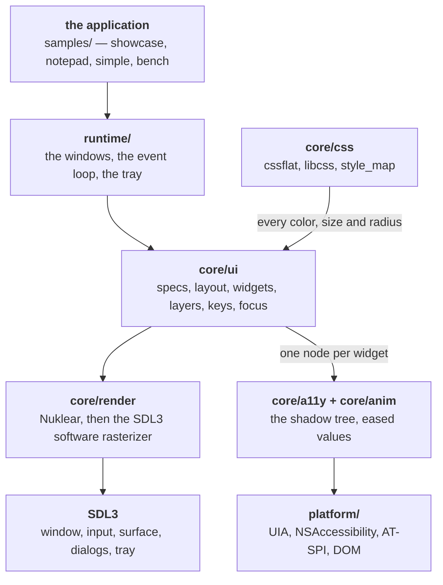

# Reaktor

**Using it** — [An application](#an-application) · [Widgets](#widgets) ·
[Layout](#layout) · [Layers](#layers) · [Styling](#styling) ·
[Keyboard](#keyboard) · [Accessibility](#accessibility) ·
[Animation](#animation) · [Beyond the specs](#beyond-the-specs)

**Inside** — [Architecture](#architecture) · [The frame loop](#the-frame-loop) ·
[Build options](#build-options) · [Command-line flags](#command-line-flags) ·
[Tests](#tests) · [The renderer](#the-renderer) · [The web build](#the-web-build) ·
[Localization](#localization) · [Text](#text) ·
[Nuklear traps](#nuklear-traps)

---

## An application

`main` makes one call, which returns the exit code when the app quits; on the
web it returns at once, and a second call returns 1.

```c
#include "reaktor/reaktor.h"
#include "reaktor/main.h"   /* in the one file that defines main */

int
main(int argc, char **argv)
{
    return launchApp(argc, argv, &(reaktor_launch){
        .name   = "Simple",
        .window = { .w = 340, .h = 180 },
        .page   = page,
        .key    = key });
}
```

The runtime owns the window, the event loop, the stylesheets, the font atlas
and the accessibility tree; the application owns what is drawn and what the
keys mean. Only `.page` is required. `launchApp` is an inline alias of
`reaktor_launch_app`, left out under `REAKTOR_NO_SHORT_NAMES`.
[`samples/simple/simple.c`](../samples/simple/simple.c) is a whole application.

`reaktor/reaktor.h` is the whole public API: it includes the rest of
[`include/reaktor/`](../include/reaktor/) — Nuklear as Reaktor configures it,
`launch.h`, `widgets.h`, `keys.h`, `a11y.h`, `ui.h`, `anim.h`, `locale.h`,
`style.h` and `text.h` — and nothing from `src/` or `core/`. `App` is opaque:
the calls below ask it what an application may know. Every sample includes
only these headers, and MSVC builds an app with implicit declarations as
errors, so an internal function cannot slip back in.

| Hook | When |
| --- | --- |
| `page(app, ctx, w, h)` | Every frame, inside a panel covering the window |
| `start(app, argc, argv)` | Once, after the window and fonts exist, with the runtime's flags removed; non-zero ends the launch with that code |
| `key(app, event)` | A key press in any window, with that window's App, before focus navigation; non-zero keeps the key and its text from everything else |
| `closing(app, reason)` | Before quitting; non-zero refuses a close button (`REAKTOR_QUIT_WINDOW`), `reaktor_request_quit` or macOS's Quit (`_APP`) and a first Ctrl+C (`_CONSOLE`). SIGTERM (`_SIGNAL`) and logoff (`_SESSION`) ask but cannot be refused |
| `stop(app)` | Once before teardown when `start` succeeded, at logoff and page unload too — the only place for cleanup |
| `file_opened(app, path)` | A picked or dropped file, with the App of the window it came to, or `NULL` when the picker was canceled or failed |

| Call | Effect |
| --- | --- |
| `reaktor_quit(app, code)` | Quit without asking. Any thread; ignored on the web |
| `reaktor_request_quit(app)` | Quit if `closing` allows. Any thread; ignored on the web |
| `reaktor_wake(app)` | Draw a frame of that App's window. Any thread |
| `reaktor_set_theme(app, theme)` | `REAKTOR_THEME_SYSTEM`, `_LIGHT` or `_DARK`, for every window |
| `reaktor_set_css(app, sheets, n)` | Replace the application's sheets; `--css` stays on top |
| `reaktor_set_title(app, title)` | Retitle that App's window |
| `reaktor_set_confirm_close(app, question)` | Ask `question` before quitting, or with `NULL` stop asking |
| `reaktor_file_open(app)` | Show the platform's file picker; the answer goes to `file_opened` |
| `reaktor_user(app)` | The launch's `.user` |
| `reaktor_sdl_window(app)`, `reaktor_sdl_renderer(app)` | That App's SDL window and renderer |
| `reaktor_icon_surface(name, px)` | An SVG asset as an `SDL_Surface`, for a tray or icon of the app's own |
| `reaktor_dark(app)`, `reaktor_get_theme(app)` | Whether it draws dark; the scheme chosen |
| `reaktor_lang_pref(app)` | The language `--lang` asked for, or `NULL` |
| `reaktor_set_borderless(app, on)`, `reaktor_borderless(app)` | Switch the main window's frame off for a titlebar of your own, drawn with `.window.hit_test` |

The `set` calls are for the main thread, take effect at the next frame, and do
nothing when nothing changes.

**Asking before closing.** `.confirm_close` is a question, such as "Close
without saving?", that the runtime asks in a modal floater with Cancel and
Quit whenever `closing` lets a quit it could refuse go ahead, bringing a
minimized or hidden window back to ask it. Quit quits with code 0 and asks
nothing more; a second Ctrl+C still quits at once.
`reaktor_set_confirm_close` copies a new question, and `NULL` stops asking and
closes the floater if it is open.

**Console.** `.console` is `REAKTOR_CONSOLE_NONE` (the window alone),
`_PARENT` (on Windows, the terminal it was started from) or `_DEBUG` (that
terminal or a console of its own, plus SDL's debug log). A redirected stream
stays redirected. Ctrl+C reaches the app only from a console it owns.

**Assets.** `.css` adds up to four sheets after tiny.css and reaktor.css
(`.no_reaktor_css` drops reaktor.css), `.font` and `.font_bold` replace
Aileron (which stands in for one that cannot be read, or that is cut short or
not a font at all), `.font_fallbacks` feed the Text module, `.icon_dirs` are searched for
`<name>.svg` before Ionicons, and `.window.icon` replaces the mark. Each is a
path, absolute or under the `.reaktor-root` marker, or named bytes (`.name`,
`.data`, `.size`) that outlive the run; `.assets` registers more, and one named
`icons/<name>.svg` stands in for that Ionicon. A `.window.icon` that cannot be
read leaves the mark. `--css`, `--font`, `--font-bold` and `--icons` beat the
struct.

## Widgets

A widget is a call taking a designated-initializer spec, every field optional.
It draws, reports itself to the accessibility tree and answers in your scope;
there is no object, handle or id to keep.

```c
if (reaktor_button(&(reaktor_button_spec){
        .label = "Save", .keys = "Control+S", .box = { .w = 120.0f } }))
    save();
```

Every spec has `.name` (the accessible name, and how layout finds the widget
again), `.style` (a selector to read instead of the widget's own) and `.box`
([Layout](#layout)). They are declared in
[`include/reaktor/widgets.h`](../include/reaktor/widgets.h).

| Widget | Call | Answers 1 | Its own fields |
| --- | --- | --- | --- |
| Button | `reaktor_button` | when pressed | `.label`, `.icon`, `.accent`, `.disabled`, `.repeat` (fires while held), `.keys`, `.on_press`, `.fit_content` (exactly as large as its label and icon, whatever `.box` asks) |
| Link | `reaktor_link` | when pressed | `.text`, `.active`, `.on_press` |
| Label | `reaktor_label` | — | `.text`, `.wrap`, `.align` (`REAKTOR_LEFT`, `_CENTRE`, `_RIGHT`), `.color` (a token), `.value`, `.silent` (left out of the tree) |
| Icon | `reaktor_icon` | — | `.name` (an Ionicon), `.accent` |
| Swatch | `reaktor_swatch` | when pressed | `.fill`, `.on_press` |
| Field | `reaktor_field` | — | `.buf`, `.len`, `.cap`, `.hint`, `.multiline`, `.filter`, `.pad_x`, `.pad_y` |
| Check | `reaktor_check` | when toggled | `.label`, `.on`, or `.flags` and `.bit`; `.box_right` |
| Radio | `reaktor_radio` | when pressed | `.label`, `.choice`, `.value` |
| Select | `reaktor_select` | when toggled | `.label`, `.on`, `.icon`, `.disc`, `.centered` |
| Slider | `reaktor_slider` | — | `.value` or `.ivalue`, `.lo`, `.hi`, `.step`, `.text` (what a screen reader hears) |
| Progress | `reaktor_progress` | — | `.value`, `.max`, `.modifiable` (draggable) |
| Knob | `reaktor_knob` | — | `.value`, `.lo`, `.hi` |
| Property | `reaktor_property` | — | `.label`, `.ivalue`, `.fvalue` or `.dvalue`, `.lo`, `.hi`, `.step`, `.grain` (per pixel dragged) |
| Combo | `REAKTOR_COMBO(...) { }` | — | `.label`, `.body_h`, `.disc`, `.swatch`; rows by `reaktor_combo_item(label, chosen)` |
| Color | `reaktor_colour_pick` | — | `.value`, a `struct nk_colorf` |
| Sidebar | `reaktor_sidebar` | when an entry is chosen | [below](#sidebar-and-tabs) |
| Tabs | `reaktor_tabs` | when an entry is chosen | [below](#sidebar-and-tabs) |

**An icon gives way to its label**: a button too narrow for both draws the
label alone. `.fit_content` makes it as large as both need.

**A field writes back** its bytes into `.buf` and its length into `*.len`, and
reads both next frame, so the length must be the field's own: one from
anywhere else reseeds the buffer. Ctrl+Z and Ctrl+R undo and redo from a
history each field keeps; editing another field, or changing the value in
code, starts it over.

**A combo opens a scope.** Its body is a Nuklear popup, laid out with
`nk_layout_row_*`. Never `return` or `break` out of a scope.

```c
REAKTOR_COMBO(.label = sizes[pick], .name = "Size", .body_h = 130) {
    for (i = 0; i < 3; i++)
        if (reaktor_combo_item(sizes[i], i == pick)) pick = i;
}
```

### Sidebar and tabs

Both take a `reaktor_nav_spec`: `.items` and `.count`, `.chosen` (the index,
written back), and optionally `.icons` (Ionicon names), `.keys` (a shortcut
per entry, announced) and `.list_keys` (announced on the list). `.kind` says
what the entries are:

| `.kind` | Entries | Answers 1 |
| --- | --- | --- |
| `REAKTOR_NAV_PAGES` (default) | Tabs, the current one selected | When another is picked |
| `REAKTOR_NAV_CHOICE` | Radio buttons | When another is picked |
| `REAKTOR_NAV_ACTIONS` | Buttons | On every press |

A sidebar is a column of rows as wide as itself; `.narrow` draws only the
icons and keeps the labels as names. Tabs are a row, each as wide as its
label. They are styled by `.sidebar-item`, `.sidebar-current` and
`.sidebar-edge` (the bar beside the current entry), and `.tab`, `.tab-current`
and `.tab-edge` (the underline).

```c
static const char *const pages[] = { "Home", "Files", "Settings" };
static int page;

if (reaktor_sidebar(&(reaktor_sidebar_spec){
        .items = pages, .count = 3, .chosen = &page, .name = "Pages",
        .box = { .w = 200.0f } }))
    show(page);
```

## Layout

Containers are scopes, and children are declared inside them.

```c
REAKTOR_COLUMN(.gap = 10.0f) {
    REAKTOR_ROW(.h = 30.0f, .gap = 6.0f, .flags = REAKTOR_LAY_FILL_X) {
        reaktor_button(&(reaktor_button_spec){
            .label = "Left", .box = { .w = 90.0f } });
        reaktor_button(&(reaktor_button_spec){
            .label = "Rest", .box = { .flags = REAKTOR_LAY_FILL_X } });
    }
}
```

| Container | Places its children |
| --- | --- |
| `REAKTOR_ROW(...)` | Left to right |
| `REAKTOR_COLUMN(...)` | Top to bottom |
| `REAKTOR_FREE(...)` | Each by its own margins; they may overlap |

`reaktor_gap(w, h)` is empty space of a size, and `reaktor_soak()` empty
space taking the width a row has left. Inside a container,
`reaktor_box_rect(&r)` gives its rectangle once placed, and `reaktor_box_id()`
its id, which is what [animation](#animation) keys on.

A container's fields, and a widget's `.box`:

| Field | Meaning |
| --- | --- |
| `.w`, `.h` | Size, and a minimum when the box also fills that axis |
| `.weight` | Its share of the space left over, against its siblings; 0 reads as 1 |
| `.gap` | Between its children |
| `.ml .mt .mr .mb` | Margins |
| `.flags` | `REAKTOR_LAY_FILL_X`, `_FILL_Y`, `_WRAP`, `_CENTER_X`, `_CENTER_Y`, `_PACK_CENTER`, `_PACK_END`, `_PACK_SPREAD` |
| `.name` | How a container is found again; a widget uses its spec's `.name` |

So `.w` alone is fixed, `.w` with `FILL_X` a minimum that grows, and `FILL_X`
with `.weight` a fraction. The outermost container ignores its own margins:
wrap it in `REAKTOR_FREE` to inset it.

**A box is placed one frame late.** A frame draws into the rectangles the one
before computed, found by accessibility id, and a box seen for the first time
waits a frame. So a size that depends on content takes a frame to settle, and
a widget whose text changes every frame needs a stable `.name` or it never has
a rectangle. After sixteen unsettled frames the runtime stops redrawing and
logs the box.

## Layers

Above the page, inside the main window: floaters, then toasts. Windows and
the tray are the system's. Their specs are in
[`include/reaktor/launch.h`](../include/reaktor/launch.h), except the toast's,
in [`include/reaktor/ui.h`](../include/reaktor/ui.h); all of them are main-thread calls.

### Floaters

A dialog inside the main window. `reaktor_floater_open` centers one whose body
is `.w` by `.h`, as CSS sizes a box, with the `dialog` rule's padding around it;
it answers its id, and calls `.body` every frame inside tiny.css's `dialog`
look, with the body's size; `.title` is its accessible name. A `.modal` one dims the window by
`--dialog-backdrop` and holds everything under it — the page, the toasts,
earlier floaters — until it closes, and Tab stays with it and the floaters
opened after it. `reaktor_floater_close` closes one, from its own body too,
and runs `.closed`. `.body` and `.closed` get the main window's App.

```c
static void
confirm(App *app, struct nk_context *ctx, int w, int h, void *user)
{
    /* nk_layout rows and widgets, as in any panel */
    if (reaktor_button_label(app, ctx, "OK"))
        reaktor_floater_close(app, *(int *)user);
}

id = reaktor_floater_open(app, &(reaktor_floater){
    .title = "Close without saving?", .w = 328, .h = 126, .modal = 1,
    .body  = confirm, .user = &id });
```

### Toasts

A message at the bottom of the main window. Four show at once, the newest
lowest; eight are kept, and a ninth drops the oldest.

```c
reaktor_toast(app, &(reaktor_toast_spec){
    .text = "'Lorem ipsum' deleted", .action = "Undo",
    .on_action = undo, .user = doc, .timeout_ms = 5000 });
```

| Field | |
| --- | --- |
| `.text`, `.icon` | The message, and an Ionicon before it |
| `.action`, `.on_action` | One button; it closes the toast before `on_action` runs |
| `.content`, `.content_w` | Controls of your own, drawn in a cell that wide |
| `.timeout_ms` | Close after that long; otherwise a toast stays until closed |
| `.no_close` | No close button; with no action either, it goes after five seconds |

`.toast` styles the surface, text, border and padding, `.toast-button` the
action and `.toast-close` the close button. Under a modal floater or an open
popup, toasts are drawn but take no input.

### Windows

`reaktor_window_open` opens a real window with its own renderer, atlas and
Nuklear context, and answers its id, or 0 on the web. `.page` draws it with
that window's App, so the same widgets and sheets work, and it follows the
main window's theme and scale. It takes its input the way the main window
does: focus navigation, the `key` hook and dropped files with its App, one
change a frame, its own animations and file picker; a wake for its App draws
it alone, and `reaktor_set_title` with its App retitles it. `.window.icon`
replaces the mark for it. A `.modal` one is the system's modal window: on
Windows and macOS the main window, close button included, takes no input
until it closes; on Linux the window manager decides. Its own close button or
`reaktor_window_close` runs `.closed`, with the main window's App. Closing the
main window quits, and every window goes with it. The Text module stays in the
main window, and only UI Automation serves a window's tree to screen readers:
NSAccessibility and AT-SPI serve the main window's.

```c
reaktor_window_open(app, &(reaktor_window){
    .window = { .title = "Details", .w = 420, .h = 230 },
    .page   = details, .user = doc });
```

### Tray

`reaktor_tray_open` puts the app's icon in the system tray, with a menu, and
answers 0 where there is no tray: the web, a desktop without one, or SDL's
`dummy` and `offscreen` video drivers. An entry
is a button, a checkbox (`.checkbox`, `.checked`) or, without a `.label`, a
separator; `.disabled` grays it out. Choosing one runs `.chosen(app, checked,
user)` on the main thread, then draws a frame. A click toggles a checkbox
before `.chosen` runs, so set checkboxes from your state with
`reaktor_tray_check(app, index, on)` each frame. `reaktor_tray_close` removes
the icon. There is one tray, of up to sixteen entries.

```c
static const reaktor_tray_item items[] = {
    { .label = "Show", .chosen = show },
    { NULL },
    { .label = "Quit", .chosen = quit }
};

reaktor_tray_open(app, &(reaktor_tray){
    .tooltip = "Notes", .items = items, .count = 3 });
```

On Linux and the BSDs, SDL loads AppIndicator (Ayatana's or the original)
and GTK 3 when the tray opens; nothing links them, and without them there is
no tray. GTK sets the user's locale as it starts, and the runtime puts the C
library's back.

## Styling

Sheets are read in order and the last rule wins, as CSS settles a tie:
tiny.css's palette (`variables-light.css` or `variables-dark.css`), tiny.css,
`reaktor.css`, the application's `.css`, then `--css`. Nothing merges them.

A widget asks for a selector and gets computed values, or `matched` clear and
Nuklear's default:

```c
reaktor_style s;
reaktor_style_get("button", &s);
if (s.matched) { /* s.bg, s.fg, s.border, s.rounding, s.pad[4], s.font_px */ }
```

| Widget | Reads |
| --- | --- |
| Button | `button`; an accent one fills with `--links` |
| Link | `a` |
| Field, check, radio, property | `input` |
| Slider | `input.type-range` |
| Progress | `progress` |
| Select, combo | `select` |
| Floater | `dialog` |
| Toast | `.toast`, `.toast-button`, `.toast-close` |
| Sidebar, tabs | `.sidebar-item`, `.sidebar-current`, `.sidebar-edge`; `.tab`, `.tab-current`, `.tab-edge` |

With `:hover` and `:active` where a widget has those states. Controls a
document lacks borrow from what they resemble: a slider's rail from `input`,
the accent from `a`, a knob's body from `button` — reading the accent off `a`
rather than a token is what lets a sheet that never declares `--links` work.

- **A size set in code beats the sheet.** A `.box = { .h = N }` locks CSS out of
  that axis, the usual reason a rule "only changes the color".
- **libcss is not a browser.** `cssflat.c` resolves `var()`, works out
  `color-mix(in srgb, …)`, writes every `rgb()` as `rgba()` with four
  arguments, clamped, turns `em` and `rem` into pixels, keeps the
  `@media (prefers-color-scheme)` branch for the active scheme and drops width
  and print queries, and rewrites `[type=range]` as `.type-range`. An operator
  form like `[href^="http"]` cannot be expressed, and its rule is dropped, as
  is a declaration with a color it cannot read. Sheets are read in the C
  locale's numbers whatever the program's locale.
  reaktor.css uses the scheme branch to strengthen light hovers and tint the
  current sidebar entry from `--links`.

`reaktor_set_css` swaps the application's sheets at the next frame. The
showcase's Styling page lays simple.css over tiny.css that way, which is the
test that the look is not in the code.

## Keyboard

| Keys | Do |
| --- | --- |
| Tab, Shift+Tab | Move focus through every focusable widget, in declared order |
| Arrows | Move focus to the next or previous sibling; on a slider, knob or property they change the value |
| Home, End | Move focus to the first or last widget |
| Enter, Space | Press the focused widget |
| Escape | Hide the focus ring |
| Ctrl+Z, Ctrl+R | Undo and redo in a field |

A field keeps the arrows, Home, End, Enter and Space while it is edited; Tab
leaves it. A modal floater or an open popup keeps focus inside. A spec's
`.keys` only announces a shortcut; bind it in the `key` hook.
[`include/reaktor/keys.h`](../include/reaktor/keys.h) matches events against a table of
shortcuts (`reaktor_shortcut_match`) and writes the same table as text for
`.keys` (`reaktor_shortcut_text`), so the two never disagree.

## Accessibility

There is nothing to do. A declared widget reports its role, name, value,
state and bounds; the tree is diffed each frame and served as UI Automation on
Windows (every window), NSAccessibility on macOS and AT-SPI on Linux and
the BSDs (the main window), and a DOM subtree beside the canvas on the web. A widget with no spec reports itself:

```c
reaktor_note(app, REAKTOR_A11Y_TREEITEM, label, NULL, state, bounds);
```

`-DREAKTOR_A11Y=OFF`, or linking `reaktor_a11y_none`, leaves the bridges out.
The tree is still built, because layout and animation key on its ids.

## Animation

[NukAnim](https://github.com/Alpaq92/NukAnim), in `external/nukanim`, runs it.
The simplest of it is a number that takes time to change, keyed by a box's id.

```c
REAKTOR_COLUMN(.name = "Track", .h = 56.0f) {
    unsigned id = reaktor_box_id();
    float    x  = reaktor_animate(id, 0, target, 320.0f,
                                  REAKTOR_EASE_CUBIC_OUT);
    /* draw at x */
}
```

The first call starts at its target: nothing has changed yet. A new target
starts a run from wherever the value is, so a change mid-flight redirects
rather than restarts. `channel`, the second argument, tells several numbers on
one box apart, and each window keeps its own. There are 31 curves, and `reaktor_ease_at(curve, t)` draws
them; `reaktor_anim_progress` says how far a run has got.

The rest of `nukanim.h` works on the window's context, `reaktor_anim(app)`:
springs, steps and béziers, colors blended in OKLAB, clips and timelines,
motion paths, oscillators and noise, and ImAnimate's way of animating a value
that keeps its own state:

```c
if (hovered) nka_animate(reaktor_anim(app), 1.0f, 1.1f, 150.0f, &size, NKA_EASE_OUT_CUBIC);
else         nka_animate(reaktor_anim(app), 1.1f, 1.0f, 250.0f, &size, NKA_EASE_OUT_CUBIC);
```

The runtime moves the context's time before each page and draws another frame
while anything the page sampled is still moving, so a page with nothing moving
asks for no frames. What is not sampled for 600 frames is forgotten. Something
that changes under the pointer needs a hot rectangle, `reaktor_hot`, for the
pointer's motion to run a frame. NukAnim's debug timeline,
`nka_show_debug_timeline`, lays out a row of its own, so it goes between
declared blocks rather than inside one, and its tooltips follow the pointer
only across a `reaktor_hot_follow` rectangle.

## Beyond the specs

Nuklear is still there. Groups, trees, list views, charts, menus and popup
bodies have no spec, and the samples call `nk_*` for them. A declared tree and
`nk_layout_row_*` cannot share a panel, so convert a whole container at a
time; a group or popup is its own panel and may be laid out by hand inside a
declared page. [`include/reaktor/ui.h`](../include/reaktor/ui.h) has the pieces the specs are made of:

| Helper | For |
| --- | --- |
| `reaktor_token`, `reaktor_col`, `reaktor_on`, `reaktor_visible` | Colors from the sheet; readable text on a background |
| `reaktor_font`, `reaktor_style_font` | A baked face, by size or by selector |
| `reaktor_ionicon`, `reaktor_ionicon_exact`, `reaktor_glyph_at` | An Ionicon as an `nk_image`, in any color, or drawn into a rectangle |
| `reaktor_svg`, `REAKTOR_MARK` | Any SVG asset, recolored by `?stroke=#rrggbb&fill=&sw=`; the mark's name |
| `reaktor_fill_round`, `reaktor_edge_round` | Rounded fills and borders, smooth on the software renderer |
| `reaktor_hot`, `reaktor_hot_top`, `reaktor_hot_follow` | A rectangle that redraws on hover ([the frame loop](#the-frame-loop)) |
| `reaktor_button_label`, `reaktor_button_icon`, `reaktor_button_accent`, `reaktor_field_text`, `reaktor_slider_bar`, `reaktor_progress_bar`, `reaktor_chevron_at` | Styled controls inside `nk_` layouts |
| `reaktor_menu_item`, `reaktor_menu_style_push`, `_pop`, `reaktor_menu_height`, `reaktor_menu_edge`, `reaktor_popup_rounding` | Menus and popups |
| `reaktor_note`, `_push`, `_pop`, `_here`, `_keys`, `_value`, `_bounds`, `reaktor_focus_activated` | The accessibility tree, and keyboard presses |
| `reaktor_focus_area`, `reaktor_focus_scroll` | A scrolling page body: the area and node focus moves within, and the rectangle it asks to see |
| `reaktor_diagnostics`, `reaktor_frame_ms` | What the Diagnostics page shows; one frame's build, render and present |
| `reaktor_process_memory`, `reaktor_process_cpu_ms` | The process's resident and private bytes, and its CPU time |

The rest is by subject: [`keys.h`](../include/reaktor/keys.h),
[`anim.h`](../include/reaktor/anim.h), [`locale.h`](../include/reaktor/locale.h),
[`text.h`](../include/reaktor/text.h), [`style.h`](../include/reaktor/style.h)
and [`a11y.h`](../include/reaktor/a11y.h).

---

## Architecture


```mermaid
flowchart TB
    app["<b>the application</b><br/>samples/ — showcase, notepad, simple, bench"]
    rt["<b>runtime/</b><br/>the windows, the event loop, the tray"]
    ui["<b>core/ui</b><br/>specs, layout, widgets, layers, keys, focus"]
    ren["<b>core/render</b><br/>Nuklear, then the SDL3 software rasterizer"]
    sdl["<b>SDL3</b><br/>window, input, surface, dialogs, tray"]

    css["<b>core/css</b><br/>cssflat, libcss, style_map"]
    tree["<b>core/a11y + core/anim</b><br/>the shadow tree, eased values"]
    plat["<b>platform/</b><br/>UIA, NSAccessibility, AT-SPI, DOM"]

    app --> rt --> ui --> ren --> sdl
    css -- "every color, size and radius" --> ui
    ui -- "one node per widget" --> tree
    tree --> plat
```

```
include/reaktor  launch.h, main.h: what an application includes first
core/base        paths, metrics, assets
core/css         cssflat and the libcss front end
core/render      Nuklear, the SDL3 backend, drawing, SVG icons
core/ui          specs, layout, widgets, the style map, keys, focus, floaters, toasts
core/a11y        the shadow tree and its diff
core/anim        NukAnim, a context a window
core/locale      the Locale module
core/text        the Text module
platform/        theme, process lifecycle, the accessibility bridges, the web keyboard
runtime/         the main window and its loop, other windows, the tray
samples/         showcase, notepad, simple, bench
tools/           the tests, the icon compiler, vmwalk
benchmarks/      bench in four other frameworks, and the sampler
external/        eleven submodules, read as they ship
```

`runtime/` and `core/` build `reaktor_runtime`, a static library every
program links. `core/locale`, `core/text` and the bridges are
[modules](#build-options), compiled into the programs that take them. Nothing
in `core/` knows which application it is in.

**The default look is compiled in**: Aileron in both weights, the mark, the
seven Ionicons the widgets draw (three chevrons, three discs and the toast's
close cross), `reaktor.css` and tiny.css's three sheets, copied byte for byte
at configure time. `reaktor_asset_load` still tries the file under the
`.reaktor-root` marker first, so an edited sheet shows without a rebuild.
Nothing is read from the working directory, and a path a user hands over is
made absolute where it is taken. The rest of Ionicons, simple.css and the
catalogs are read from files; an icon that is not there is drawn as nothing,
and the log names it.

**`style_map.c` is the only writer of `nk_style`.** A widget style set
anywhere else lasts until a theme change reloads the sheets. libcss never
takes a sheet's rules back out of its store, so every load rebuilds it.

## The frame loop

There is no loop. SDL runs the iterate callback when an event arrives, and it
returns at once unless something marked the frame dirty: a widget clicked,
typed into or dragged; the pointer crossing a **hot rectangle** registered
the frame before, which is how hover repaints without polling; the window
resizing or changing scheme; an animation still running. Each window has its
own frames: a wake carries the window it is for.

While a mouse button is held, frames follow the display's refresh, with two
more after the release. A turn of the wheel takes two frames, because Nuklear
scrolls a panel after drawing it.

A finger that moves mostly up or down, by more than 8 pixels, scrolls the
panel under it: the runtime releases what the finger pressed away from every
widget, so nothing is clicked, and turns its movement into wheel steps sized
to the page body `reaktor_focus_area` names, or to the window. A fast swipe
coasts on after the finger lifts, and a touch stops it. Sideways drags, and
drags that start in a text field, stay drags.

Nuklear reads input as it stands at a frame's end: a button pressed and
released within one frame was never down. So a frame takes one change — a
button or a key — or a run of text, and faster input is spread over the frames
it needs, in order. A printable key without Ctrl or Cmd is only its text.

A click that activates a window also reaches the widget under it, except on
macOS, where the first click only activates.

At rest the app uses 0% of a core. **Adding a timer or an unconditional
repaint to make something update is the wrong fix** — mark what changed.
[PERFORMANCE.md](PERFORMANCE.md) has the costs.

## Platforms

| System | Architectures | Checked on |
| --- | --- | --- |
| Windows | x64, x86, ARM64 | Windows Server 2025 runners for x64 and x86, a Windows 11 runner for ARM64 |
| macOS | Apple silicon, Intel | macOS 15 runners, one of each |
| Linux | x86-64, x86, ARM64, ARMv7 (armhf), RISC-V 64 | Debian 12 (13 for RISC-V): natively for x86-64, x86 and ARM64, under QEMU for ARMv7 and RISC-V |
| FreeBSD | x86-64, ARM64 | 15.1 |
| OpenBSD | x86-64, ARM64 | 7.9 |
| NetBSD | x86-64, ARM64 | 11.0 |
| Web | WebAssembly | Chromium; emscripten 6.0.9 targets Chrome 85, Firefox 79 and Safari 15 |

Every pull request builds each native one, runs the seven console tests, and
writes a `--shot` and an `--a11y-dump` of `simple` and the showcase through
the system's video driver and SDL's `dummy` one: `.github/workflows/` holds a
workflow per system. The BSDs run in virtual machines, ARM64 among them under
emulation, and a job that emulates may fail without failing its run. The web
build is built and packed on every pull request too (`web.yml`), and checked
by hand in headless Edge, as desktop, Android and iOS.

`build.sh` builds for the machine it runs on. `build.ps1 -Arch x86` (or `x64`,
`arm64`) builds that architecture with MSVC's matching toolset, into
`build-<arch>` when it is not the machine's own; ARM64 needs Visual Studio's
ARM64 build tools.

**Releases.** Pushing a `v*` tag runs `release.yml`: the four native
workflows again, with every job required, a web build, and a GitHub release
of what they packed — one archive per system and architecture, the three
WebAssembly programs, libreaktor for each ([In your own project](#in-your-own-project)),
the source with its submodules, which GitHub's own archives leave out, and a
`SHA256SUMS` of them all. `tools/package.sh <build> <folder> [.exe]` packs a native
one: the four programs without their symbols, the `.reaktor-root` marker, the
files they read at runtime (`tools/assets.sh`, which the macOS app bundle uses
too), `licenses/` and `NOTICE.md`. Each job runs the packed showcase and
checks it draws its Translations page as the built one does. Windows links the
C runtime statically (`-DCMAKE_MSVC_RUNTIME_LIBRARY=MultiThreaded`); the macOS
app is signed ad hoc, not notarized; Linux needs glibc 2.36, or 2.41 on
RISC-V; a BSD package wants the release it was built on.

## In your own project

**Embedded.** Add the checkout, submodules and all, and declare the app:

```cmake
add_subdirectory(reaktor)    # or FetchContent, which clones the submodules too
reaktor_add_app(myapp SOURCES main.c)
```

Under another project Reaktor builds none of its samples or tests and
installs nothing (`REAKTOR_SAMPLES`, `REAKTOR_TESTS` and `REAKTOR_INSTALL`
default to on only at the top), and its settings stay in its own directory.

**libreaktor.** Each release carries `libreaktor-<version>-<system>-<arch>`
for every platform above, and `-wasm`. Build one yourself with:

```bash
cmake --build build --target libreaktor
cmake --install build --prefix libreaktor --component libreaktor
```

It is one static library — `reaktor.lib` with MSVC, `libreaktor.a` elsewhere
— holding Reaktor, every module, SDL, libcss, plutosvg, Onlay, mojibake and
kb_text_shape, merged with `lib.exe`, Apple's `libtool` or an `ar` MRI
script. Beside it go the public headers with Nuklear's and SDL's, a CMake
package, a pkg-config file and `share/reaktor/licenses`:

```cmake
find_package(reaktor 0.2 REQUIRED)
add_executable(app WIN32 main.c)
target_link_libraries(app PRIVATE reaktor::reaktor)
```

`pkg-config --cflags --libs reaktor` answers the same outside CMake. The
library takes the C runtime its build used: the release's Windows ones use
the DLL runtime, CMake's default, while the programs in a release link it
statically. On the web, point `reaktor_DIR` at its `lib/cmake/reaktor`, as
the emscripten toolchain searches only its own sysroot.
[`examples/consumer`](../examples/consumer) builds `samples/simple/simple.c`
against an installed package: every CI job does, and checks it draws as the
in-tree build does.

## Build options

Passed to CMake, through either script:

```bash
./build.sh -- -DREAKTOR_A11Y=OFF        # macOS, Linux, the BSDs
./build.ps1 -DREAKTOR_A11Y=OFF          # Windows; build-wasm.* take the same
```

| Option | Default | Effect |
| --- | --- | --- |
| `REAKTOR_A11Y` | `ON` | Serve the accessibility tree to screen readers |
| `REAKTOR_LOCALE` | `ON` | Translations and formatting — [Localization](#localization) |
| `REAKTOR_LOCALE_EMBED` | `OFF` | Compile the catalogs in rather than read them at startup |
| `REAKTOR_TEXT` | `ON` | Direction, shaping, fallback glyphs and Unicode line breaks — [Text](#text) |
| `REAKTOR_SDL_GL` | `OFF` | Build SDL's OpenGL and GLES drivers on Linux and the BSDs |
| `REAKTOR_SAMPLES`, `REAKTOR_TESTS` | `ON` at the top | Build the samples, and the tests in `tools/` |
| `REAKTOR_INSTALL` | `ON` at the top | Install rules for libreaktor's files |

**CMake keeps an option**, so a build without the flag keeps the last value;
pass `=ON` to switch one back.

**A module is two interface libraries**, and a program links one:
`reaktor_a11y` or `reaktor_a11y_none`, and likewise `_locale` and `_text`.
Both define the same functions. The showcase takes all three modules;
`simple`, `notepad` and `bench` take none, and show what the runtime costs
alone. An option switched off swaps in the `_none` half everywhere, and leaves
pixels and `--a11y-dump` byte-identical apart from what the module itself
produces.

```cmake
reaktor_add_app(myapp MODULES a11y locale SOURCES main.c)
```

`reaktor_add_app` links the modules named and the `_none` half of the rest
(all three when `MODULES` is left out, none with `MODULES none`), builds a
windowed program unless `CONSOLE` is given, and on the web adds the link
options a page needs; `ASSETS <file>@<path>` packs files beside it there.

- **`REAKTOR_A11Y=OFF`** drops the bridges and the libraries only they need:
  `uiautomationcore`, `ole32` and `oleaut32` on Windows, `dbus-1` on Linux and
  the BSDs. It saves few bytes ([PERFORMANCE.md](PERFORMANCE.md#modules)); the
  reason to use it is not needing `dbus-1`.
- **`REAKTOR_LOCALE=OFF`** leaves every string as its key, bakes Latin-1
  alone, and stops the web build packing the catalogs and the Japanese font.
- **`REAKTOR_LOCALE_EMBED=ON`** reads `assets/locale/*.txt` into the program
  at configure time; an edited catalog reconfigures on the next build.
- **`REAKTOR_TEXT=OFF`** leaves mojibake and kb_text_shape out. Nothing is
  reordered, shaped or taken from another font, and a line breaks after a
  space: Polish is untouched, Japanese comes out as boxes.

## Command-line flags

Reaktor reads no environment variables. The runtime takes these flags and
removes them from `argv` before the application sees it:

| Flag | Effect |
| --- | --- |
| `--shot <path.bmp>` | Write the window once it settles, then quit |
| `--a11y-dump <path>` | Write the accessibility tree once it settles |
| `--theme <system\|light\|dark>` | Open in that scheme; on OpenBSD `system` reads as light |
| `--lang <code>` | Open in that catalog: `en`, `pl`, `ja` |
| `--font-fallback <path>` | A font for the Text module, before the application's; repeatable |
| `--renderer <name>` | `software` (default), `auto`, or a driver name |
| `--video <name>` | SDL's video driver: `x11`, `wayland`, `dummy` |
| `--console <none\|parent\|debug>` | Override `.console` |
| `--css <path>` | A sheet after the application's; up to four |
| `--font <path>`, `--font-bold <path>` | Replace the UI face and its bold |
| `--icons <dir>` | Look for `<name>.svg` here first; up to four |

The showcase adds:

| Flag | Effect |
| --- | --- |
| `--tab <0-9>` | Login, Buttons, Inputs, Display, Layout, Popups, Animation, Styling, Translations, Diagnostics |
| `--scroll <px>` | How far that page starts scrolled |
| `--floater`, `--modal-floater` | Open the Popups page's floater, or its modal one |
| `--toasts` | Show three of its toasts |
| `--window`, `--modal-window` | Open its window, or its modal one |

And `bench`:

| Flag | Effect |
| --- | --- |
| `--bench-seconds <n>` | Draw for that long, print, quit |
| `--no-vsync` | Free-run, so the figures measure drawing, not waiting |
| `--fps <n>` | Hold to a rate, sleeping out the rest of each frame |
| `--boxes <n>` | How many boxes rotate (64) |

`--shot` and `--a11y-dump` are the regression oracle: pin the view with
`--tab`, `--scroll` and `--theme`, and diff two dumps — anything that moved by
a pixel says so.

```bash
./build/showcase --tab 7 --theme dark --shot styling.bmp --a11y-dump styling.txt
```

## Tests

Built by default and run from `build/`:

| | |
| --- | --- |
| `laytest` | The layout engine's placement |
| `onlaytest` | Onlay's own suite, unmodified |
| `a11ytest` | Node identity, the diff, the pool |
| `animtest` | Curves, retargeting, a context a window |
| `keytest` | Chord parsing and formatting |
| `localetest` | Catalogs, lookup, plural rules, formatting |
| `texttest` | Line breaks, direction, measuring and glyph order, against `assets/fonts`; with the Text module |
| `launchtest` | Opt-in (`./build.ps1 launchtest`): `launchApp`'s hooks by mode (`start-fail`, `quit`, `veto`, `title`, `confirm`, `confirm-cancel`), what a floater, toast or popup holds and where keys go (the `hold-` modes), and a window beside the main one (`window-text` and the `win-` modes: keys, drops, animation, title, theme, wakes, a drag, one change a frame, the picker, memory) |

Beyond those, check a visual change against the framebuffer (`--shot`) and the
dump, not against a reading of the source.

## The renderer

`software` is the default on every platform. The app draws nothing at rest,
so a GPU buys it nothing measurable, and costs a great deal on a machine
without one: SDL's software renderer took 13.1 ms of CPU a frame where
Direct3D on WARP took 78.7. One rasterizer is also one set of pixels to reason
about. `--renderer auto` lets SDL choose; a driver name pins one.

- **Every vertex is snapped to the pixel grid**, so a sub-pixel correction is
  discarded, and abutting rectangles can round apart into a seam.
- **A rectangle is drawn from device pixels** by `nk_sdl_quad`, because SDL's
  software renderer turns two triangles into a fill and truncates position and
  size apart at fractional scales.
- **A one-pixel stroke is two half-alpha rows**, so borders are fills:
  `reaktor_edge_round`. Fill anti-aliasing is off on every renderer, so rounded
  fills are masks: `reaktor_fill_round`, and each rounded fill Nuklear draws
  itself — a scrollbar, a tree's header, a combo, a menu item — is swapped for
  masks before the frame is drawn.

`core/render/nk_sdl3_renderer.h` is Nuklear's SDL3 backend, vendored because
one change sits inside `nk_sdl_font_stash_end`. Every deviation is marked
`REAKTOR`: an 8-bit indexed atlas, a 1×1 white texture for untextured
geometry, pixel snapping, fills and strokes feathered apart, the atlas palette
shared with the Text module, rectangles from device pixels, `tex_null`
repointed after every bake, a key-up dropped for a key Nuklear does not hold,
text input of any length fed one rune at a time, and textures clamped rather
than tested for wrapping.

## The web build

The same sources and `CMakeLists.txt`. `./build-wasm.sh` (emsdk) writes
`showcase.html`, `simple.html` and `notepad.html` into `build-wasm/`, which
must be served over HTTP. Every push to `master` publishes the showcase to
[GitHub Pages](https://alpaq92.github.io/Reaktor/) through
`.github/workflows/pages.yml`, pinned to the emscripten the published sizes
were built with.

- **Only the assets the sources name are packed**, found at configure time,
  minus the ones compiled in; the showcase alone adds the catalogs and the
  Japanese font. `tools/shell.html` is the page; its loading overlay must keep
  `pointer-events: none` or it swallows every click.
- **A phone types into a hidden `input`** (`platform/web/keyboard_web.c`). Its
  contents are diffed against what the app was told, and the edits go onto
  SDL's own queue so they keep their place among taps and keys. The tap
  focuses it in its own `pointerup`, as Safari requires, and the touch's
  `pointerdown` is canceled, or the canvas takes focus and the keyboard
  closes. `?keylog` overlays every input event as it arrives.
- **A hidden page runs no frames**: the loop waits on
  `requestAnimationFrame`. The accessibility root exists from `main()`, but
  the tree stays empty until the page renders.
- **The accessibility tree is `position: fixed`.** A node lies where its widget
  does, even off the canvas, and absolutely positioned it would widen the page
  past a phone's screen.

## Localization

The Locale module translates what a program says and formats what it counts.
The showcase's Translations page is the working example, in English, Polish
and Japanese.

**A catalog** is `assets/locale/<code>.txt`, an entry a line, split at the
first ` = `; `\n` is a newline and `\\` a backslash. `language` is the
catalog's own name for itself, `plural` a gettext plural expression. There are
no comments, because a key is free text.

```
language = Polski
plural = n==1 ? 0 : n%10>=2 && n%10<=4 && (n%100<10 || n%100>=20) ? 1 : 2
file.save = Zapisz
file.count = {n} plik | {n} pliki | {n} plików
number.decimal = ,
money.PLN = zł
date.long = d MMMM y
```

```c
reaktor_button(&(reaktor_button_spec){ .label = reaktor_tr("file.save") });
reaktor_label(&(reaktor_label_spec){
    .text = reaktor_trn("file.count", n, buf, sizeof buf) });   /* 3 pliki */
reaktor_format_money(buf, sizeof buf, 1234.5, "PLN");           /* 1234,50 zł */
reaktor_format_date(buf, sizeof buf, localtime(&now), REAKTOR_DATE_LONG);
```

`reaktor_tr` answers the current catalog's value, or the key when there is
none, so an untranslated string shows as its key. `reaktor_trn` picks a
` | ` form by the plural rule and writes `{n}` formatted. Each formatter writes
at most `cap` bytes and answers `buf`.

Formatting reads these keys, and a key a catalog leaves out is English's:

| Key | English | |
| --- | --- | --- |
| `number.decimal`, `number.group` | `.` `,` | Separators |
| `number.group.min` | `1` | Fewest digits before the first group separator |
| `money` | `{s}{n}` | Where symbol and amount go |
| `money.<code>`, `money.<code>.digits` | the code, `2` | A currency's symbol and decimals |
| `date.short`, `date.long`, `date.full` | `M/d/yy`, `MMMM d, y`, `EEEE, MMMM d, y` | Patterns |
| `time.short` | `h:mm a` | |
| `date.months`, `date.months.short` | `January \| …` | Twelve forms |
| `date.days`, `date.days.short` | `Sunday \| …` | Seven, Sunday first |
| `time.ampm` | `AM \| PM` | |

A pattern is made of `d dd M MM MMM MMMM y yy EEE EEEE H HH h hh m mm a`, with
`'quoted'` text kept. The weekday is computed from the date. A catalog says
how its language writes numbers the way it says "Save" — Polish puts
no-break spaces between digit groups and before its symbol — and a symbol of
letters is always kept a space off the amount: `PLN 12.00`.

**The language** is `--lang` when a catalog has it, else the system's: the
first of its preferred languages that a catalog has, else English, else the
first catalog, and it changes when the system's does.
`reaktor_locale_set(code)` switches at any time and stops following the
system; `reaktor_locale_set(NULL)` follows it again, and
`reaktor_locale_system()` says whether it does.

**Leave `.name` to the translated text**, so a screen reader reads what is
drawn; the cost is that a switch makes each translated widget new, placed a
frame late and dropping focus.

The atlas bakes Latin-1 plus every character the catalogs use that Aileron
has; the rest is the [Text](#text) module's. Formatting stops at the patterns
above: no time zones, only the Gregorian calendar, groups of three only.

## Text

Nuklear draws a string from the atlas, glyph after glyph, left to right. The
Text module draws every string that needs more, and breaks lines as Unicode
says; a string the atlas can draw is left to Nuklear.

- **Direction** by the bidirectional algorithm, through
  [mojibake](https://github.com/zaerl/mojibake): Arabic and Hebrew run right to
  left with numbers and Latin inside them the right way round, and a wrapped
  right-to-left paragraph keeps to the right edge.
- **Shaping** by [kb_text_shape](https://github.com/JimmyLefevre/kb), per run
  of one direction, script and font: Arabic joins, marks sit on their letters,
  Devanagari reorders and forms conjuncts. Kerning is off, as in the atlas.
- **Fallback glyphs** from the first font that has them: the face's own file,
  each `--font-fallback`, then each font from `reaktor_text_add_fallback`,
  chosen a grapheme at a time.
- **Any size or weight.** A glyph is rasterized when first drawn, at its size,
  into the module's 512×512 textures, on the pixel grid. Bold takes its
  fallback glyphs from the same fonts.
- **Lines break by UAX #14**: between Japanese characters but not before a
  full stop or small kana, after a hyphen, never inside a number. A wrapped
  label is measured with the breaks it is drawn with.

**How it gets in.** The module takes over each baked face's width function,
so Nuklear measures as it will draw. Before the frame becomes vertices,
`reaktor_text_prepare` swaps each text command the atlas cannot draw for a
custom command in the same place, whose callback adds the glyph quads.
Shaping is cached by string and font, glyphs by font, glyph and size; each
cache starts over when full. Its bidi levels match mojibake's by order, since
mojibake 0.3.6 records `byte_offset` at a character's last byte.

**Fonts are the application's.** The showcase ships M PLUS 1p for Japanese, as
a `.font_fallbacks` entry; Arabic, Hebrew or an Indic script needs a font that
has it:

```bash
./build/showcase --font-fallback C:/Windows/Fonts/segoeui.ttf --font-fallback C:/Windows/Fonts/Nirmala.ttc
```

A collection is read at its first font. Without the module,
`reaktor_text_none` breaks after a space, or before the glyph that would not
fit, keeping the glyph `nk_label_wrap` would lose. mojibake is built with only
what is called, and kb_text_shape is one header compiled in `core/text/kb.c`;
together they are most of the module's size
([PERFORMANCE.md](PERFORMANCE.md#modules)).

Not yet: editing shaped text (a field's caret moves in stored order, a glyph
at a time); right alignment for a single-line right-to-left label;
language-specific forms; color glyphs, emoji and vertical text;
normalization, case mapping and collation.

## Nuklear traps

None is a bug, and each cost an afternoon.

- **Buttons fire on release.** A browser delivers press and release in one
  task, so a press needing a held frame never fires;
  `NK_BUTTON_TRIGGER_ON_RELEASE` is defined.
- **A button's content rect is bounds − padding − border − rounding.** A large
  radius drives a small button's content negative and its symbol vanishes.
- **A negative content rect moves the label instead of hiding it**: tiny.css's
  inset drew labels 4.6 px low on 30 px controls. `style_map.c` trims the
  vertical padding to what the row holds.
- **`nk_stroke_rect` is asymmetric**, 1 px on the left and top of a 2 px
  border, 2 on the right and bottom. Nothing here strokes a border.
- **`nk_draw_button_text_symbol` always centers the label**; alignment only
  picks the glyph's side.
- **`nk_do_selectable_image` reads inverted**: `NK_TEXT_ALIGN_LEFT` pins the
  image right.
- **A tree header's border is square**: `NK_TREE_TAB` fills it at rounding 0,
  as does `nk_combo_begin_color`.
- **There is one `window.rounding`**, popups included.
- **`nk_menubar_begin` must come first** in its panel, and pins its row out of
  the scroll.
- **A menu's height needs the real row spacing**, 4 rather than 2, or the last
  item lands on the clipped edge.
- **`nk_group_begin` answers 0 when scrolled out of view**; returning early on
  it blanks everything below.
- **`NK_POPUP_DYNAMIC` strokes its border at the bounds before shrinking**, so
  `nk_tooltip` leaves a ghost frame.
- **`nk_layout_space` does not nest.**
- **`nk_image` stretches to its slot**, whatever its raster size.
- **`nk_rule_horizontal` fills its widget rect**: the row height is the line.
- **`nk_sdl_font_stash_begin` leaks the atlas it replaces.**
- **`nk_label_wrap` breaks at spaces only**, losing the glyph that overflowed a
  line without one; `reaktor_label` breaks its own lines.
- **A merged font joins the atlas's first font**, whichever the call meant.
- **`cfg.range` is read on every glyph lookup**, so the ranges live as long as
  the fonts; `App` holds them.
- **Edit state lives on the window**, so the page's window misses every field
  inside a group; `app->editing` is what navigation asks.
- **`nk_edit_string` leaves the bytes past the length alone**, so a field's
  buffer read as a string is its last, longer value.
- **An empty edit has no text pointer**, while `nk_str_len_char` still answers
  a length.
- **Only `ctx->active` gets input**; every other window carries a sticky
  `NK_WINDOW_ROM` until a click or hover activates it.
